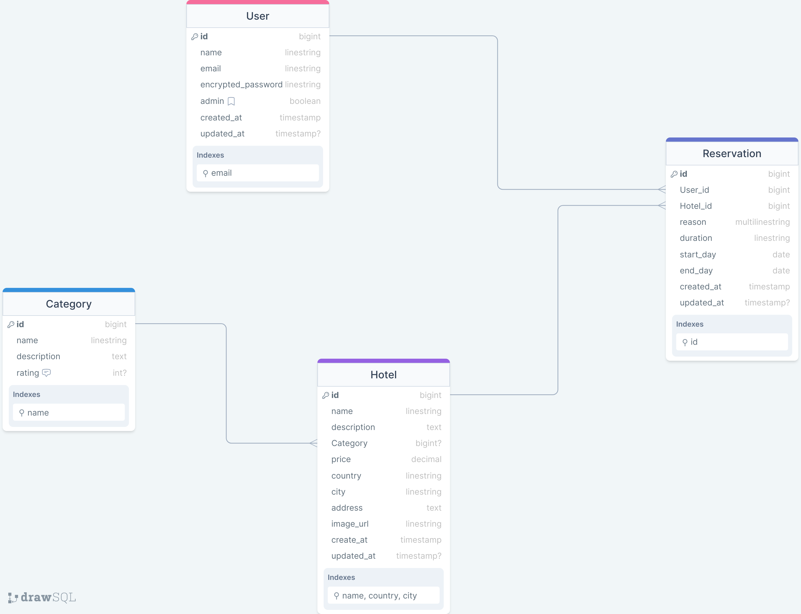

# HOTEL-RESERVATIONS-BACK-END

The backend API for the **HOTEL-RESERVATIONS-Front-End** UI, built with Ruby-on-Rails and Postgresql. The schema was setup following the ERD below.

## Entity Relationship Diagram



## Built with

- Ruby
- Rails (RoR)
- Postgresql
- Rubocop

## Front-End

You can access the front-end of this application via [this link](https://github.com/Lembani/hotel-reservation-frontend.git).

## SetUp

To get a local copy up and running, follow these steps:

- You should have **_Ruby_** installed on your computer.
- You should also have **_Rails_** installed on your computer.
- Clone this repository into your computer by running the following command in your terminal:

```
git clone https://github.com/Lembani/hotel-reservation-backend.git
```

- Run this command in the cloned directory, to install required gems:

```
bundle install
```

- Run `Rubocop -A` and fix linters errors, if any.

* Run the project in your browser:

```
rails server
```

## Authors

👤 **Chia Carlyle**

- LinkedIn: [](https://linkedin.com/in/chia-carlyle)

- GitHub: [](https://github.com/carlylechia)

- Twitter: [](https://twitter.com/chiacarlyle)

- Gmail: [](mailto:chiacarlyle@gmail.com)

<hr>

👤 **Nwachukwu Ekene**

- GitHub: [@ekenecf](https://github.com/ekenecf)
- LinkedIn: [Nwachukwu-Ekene](https://www.linkedin.com/in/nwachukwuekene/)
- Twitter: [Nwachukwu-Ekene](https://www.twitter.com/ekene070)
- Gmail: [ekens2u@gmail.com](mailto:ekens2u@gmail.com)

<hr>

👤 **Lembani Sakala**

- GitHub: [@Lembani](https://github.com/lembani)
- Twitter: [@Lembani\_](https://twitter.com/lembani_)
- LinkedIn: [lembani-sakala](https://linkedin.com/in/lembani-sakala)
- Gmail: [lembanisakala@gmail.com](mailto:lembanisakala@gmail.com)

<hr>

👤 **Frankline Osoro**

- GitHub: [@frank1738](https://github.com/frank1738)
- Twitter: [@frankhiggins08](https://twitter.com/frankhiggins08)
- LinkedIn: [Frankline Osoro](http://www.linkedin.com/in/frankline-osoro-b526ba18b)

## 🤝 Contributing

Contributions, issues, and feature requests are welcome!

Feel free to check the [issues page](../../issues/).

## Show your support

Give a ⭐️ if you like this project!

## Acknowledgments

- Hat tip to Microverse
- We acknowledge [Murat Korkmaz on Behance](https://www.behance.net/muratk) for designing the wireframe used for this project.

## 📝 License

This project is [MIT](./MIT.md) licensed.
